# Lakayan'm Database Design 🇭🇹

## Entity Relationship Diagram

```mermaid
erDiagram
    %% Core Geography
    departments {
        uuid id PK
        string slug UK "nord, ouest, etc"
        string name "Nord — The Kingdom's Legacy"
        string intro "Department description"
        string hero_url
        boolean is_published
        datetime created_at
    }
    
    cities {
        uuid id PK
        uuid department_id FK
        string slug "cap-haitien, milot"
        string name "Cap-Haïtien"
        string summary
        float lat
        float lng
        string hero_url
        boolean is_published
        datetime created_at
    }
    
    %% Content & Culture
    places {
        uuid id PK
        uuid city_id FK
        enum kind "restaurant|hotel|landmark|etc"
        string name
        string slug
        string description
        string address
        string phone
        string website
        string order_url
        string booking_url
        string price_range
        float lat
        float lng
        string cover_url
        boolean is_published
        boolean is_featured
        string owner_id FK
        string menu_url
        json menu_items
        string booking_phone
        json opening_hours
        enum activity_type
        datetime event_date
        datetime event_end_date
        datetime created_at
    }
    
    figures {
        uuid id PK
        uuid city_id FK
        string name "Toussaint Louverture"
        string slug
        string bio
        int birth_year
        int death_year
        string portrait_url
        string full_name "François-Dominique Toussaint Louverture"
        string category "Revolutionary Leader"
        string birth_place "Habitation Bréda"
        string death_place
        string legacy
        string famous_works
        json lived_addresses "Array of addresses"
        json worked_addresses
        json monuments
        string contemporaries
        string movements
        json quotes "Famous quotes"
        boolean is_published
        datetime created_at
    }
    
    %% Future Cultural Heritage
    streets {
        uuid id PK
        uuid city_id FK
        string name
        string named_after
        string story
        float lat
        float lng
        string image_url
        boolean is_published
        datetime created_at
    }
    
    historical_events {
        uuid id PK
        uuid city_id FK
        string title
        string description
        datetime date
        int year
        string location
        string image_url
        string importance "national|regional|local"
        boolean is_published
        datetime created_at
    }
    
    %% User Management
    users {
        cuid id PK
        string email UK
        string password
        string name
        string role "user|admin|business"
        datetime emailVerified
        string image
        datetime created_at
        datetime updated_at
    }
    
    accounts {
        cuid id PK
        string userId FK
        string type
        string provider "github|google"
        string providerAccountId
        string refresh_token
        string access_token
        int expires_at
        string token_type
        string scope
        string id_token
        string session_state
    }
    
    sessions {
        cuid id PK
        string sessionToken UK
        string userId FK
        datetime expires
    }
    
    %% Business Model
    business_plans {
        uuid id PK
        string code UK "starter|growth|premium"
        string name "Growth Plan"
        int price_month_cents "3000 = $30"
        json features
    }
    
    subscriptions {
        uuid id PK
        string owner_id FK
        uuid plan_id FK
        string status "active|cancelled"
        datetime current_period_start
        datetime current_period_end
    }
    
    %% Analytics & Engagement
    reviews {
        uuid id PK
        uuid place_id FK
        string user_id FK
        string author_name
        int rating "1-5 stars"
        string comment
        boolean is_verified
        datetime created_at
    }
    
    place_views {
        bigint id PK
        uuid place_id FK
        string user_id
        datetime occurred_at
    }
    
    media {
        uuid id PK
        string bucket "public"
        string path
        string alt
        uuid place_id FK
        uuid city_id FK
        datetime created_at
    }
    
    %% Relationships
    departments ||--o{ cities : "has many"
    cities ||--o{ places : "contains"
    cities ||--o{ figures : "birthplace/lived"
    cities ||--o{ streets : "has streets"
    cities ||--o{ historical_events : "events occurred"
    cities ||--o{ media : "city photos"
    
    users ||--o{ places : "owns business"
    users ||--o{ subscriptions : "pays for"
    users ||--o{ reviews : "writes"
    users ||--o{ accounts : "oauth accounts"
    users ||--o{ sessions : "active sessions"
    
    places ||--o{ reviews : "receives reviews"
    places ||--o{ place_views : "analytics"
    places ||--o{ media : "photos/gallery"
    
    business_plans ||--o{ subscriptions : "subscription type"
```



## Table Details

### 🗺️ **Geography Hierarchy**
```
departments (9 total)
    ↓
cities (27+ across all departments)
    ↓
places (restaurants, hotels, landmarks)
figures (historical/cultural icons)
streets (named after heroes)
historical_events (significant moments)
```

### 👤 **User Types & Permissions**
- **Regular Users**: Browse, review places
- **Business Owners**: Manage their places, pay subscriptions
- **Admins**: Manage all content, approve businesses

### 💰 **Revenue Model**
```
Free Tier: Public browsing
↓
Starter ($10/month): Basic business listing
↓
Growth ($30/month): Featured placement + booking
↓
Premium ($50/month): Homepage features + priority support
```

### 🎯 **Key Features**

#### **Historical Figures (Enhanced)**
- **Rich Biographies**: Full life stories with cultural context
- **Address History**: Where they lived, worked, created
- **Legacy Tracking**: Their impact on Haiti today
- **Cultural Connections**: Relationships with contemporaries
- **Famous Quotes**: Memorable words that define them
- **Monument Mapping**: Where to find memorials today

#### **Places (Business Ready)**
- **Multi-category**: Restaurants → Royal Palaces
- **Business Features**: Menus, booking, ordering
- **Tourism Ready**: Addresses, directions, hours
- **Review System**: Community-driven recommendations
- **Analytics**: Track popular destinations

#### **Cultural Heritage**
- **Street Stories**: Why streets are named after heroes
- **Historical Events**: Timeline of significant moments
- **Media Gallery**: Photos preserving history
- **Geographical Context**: GPS coordinates for everything

### 🔄 **Data Flow Example**

```
Tourist visits /dept/nord/city/cap-haitien
    ↓
Sees Toussaint Louverture profile
    ↓
Learns he was born at Habitation Bréda
    ↓
Clicks on Habitation Bréda landmark
    ↓
Gets address & directions to visit
    ↓
Leaves review after visiting
    ↓
Discovers nearby Lakay Restaurant
    ↓
Books table through platform
```

## Schema Highlights

### **JSON Fields for Flexibility**
- `lived_addresses`: `["Habitation Bréda du Haut-du-Cap", "Plantation at Petit-Cormier"]`
- `quotes`: `["En me renversant, on n'a abattu que le tronc de l'arbre..."]`
- `monuments`: `["Monument at former Habitation Bréda site", "Lycée Toussaint Louverture"]`
- `opening_hours`: `{"mon": "9-17", "tue": "9-17", "sun": "closed"}`
- `menu_items`: `[{"name": "Griot", "price": 15, "description": "Traditional pork"}]`

### **Scalability Features**
- **UUID Primary Keys**: Distributed system ready
- **Soft Deletes**: `is_published` flags preserve history
- **Audit Trail**: `created_at`, `updated_at` tracking
- **Media Management**: Separate table for photos/documents
- **Analytics**: View tracking without performance impact

---

*Built with ❤️ for Haiti's cultural preservation and tourism growth*